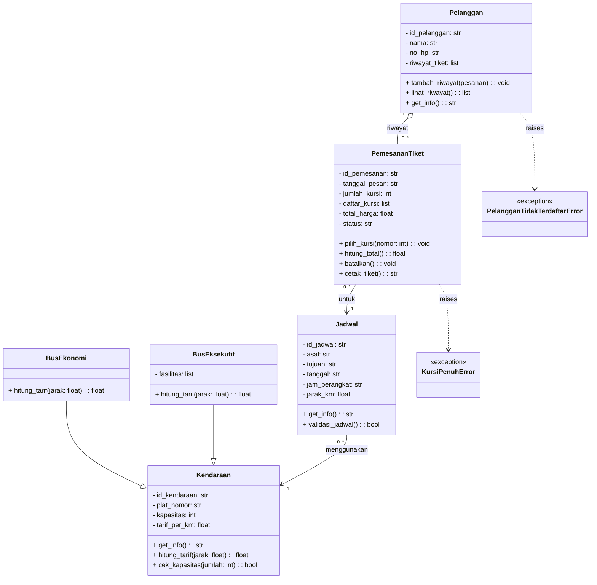

# aplikasi-manajement-transportasi-umum-bus

```mermaid
classDiagram
    class Kendaraan {
        - id_kendaraan: str
        - plat_nomor: str
        - kapasitas: int
        - tarif_per_km: float
        + get_info(): str
        + hitung_tarif(jarak: float): float
        + cek_kapasitas(jumlah: int): bool
    }

    class BusEkonomi {
        + hitung_tarif(jarak: float): float
    }

    class BusEksekutif {
        - fasilitas: list
        + hitung_tarif(jarak: float): float
    }

    class Jadwal {
        - id_jadwal: str
        - asal: str
        - tujuan: str
        - tanggal: str
        - jam_berangkat: str
        - jarak_km: float
        + get_info(): str
        + validasi_jadwal(): bool
    }

    class PemesananTiket {
        - id_pemesanan: str
        - tanggal_pesan: str
        - jumlah_kursi: int
        - daftar_kursi: list
        - total_harga: float
        - status: str
        + pilih_kursi(nomor: int): void
        + hitung_total(): float
        + batalkan(): void
        + cetak_tiket(): str
    }

    class Pelanggan {
        - id_pelanggan: str
        - nama: str
        - no_hp: str
        - riwayat_tiket: list
        + tambah_riwayat(pesanan): void
        + lihat_riwayat(): list
        + get_info(): str
    }

    class KursiPenuhError {
        <<exception>>
    }

    class PelangganTidakTerdaftarError {
        <<exception>>
    }

    BusEkonomi --|> Kendaraan
    BusEksekutif --|> Kendaraan

    Jadwal "0..*" --> "1" Kendaraan : menggunakan
    PemesananTiket "0..*" --> "1" Jadwal : untuk
    Pelanggan "1" o-- "0..*" PemesananTiket : riwayat

    PemesananTiket ..> KursiPenuhError : raises
    Pelanggan ..> PelangganTidakTerdaftarError : raises
```
